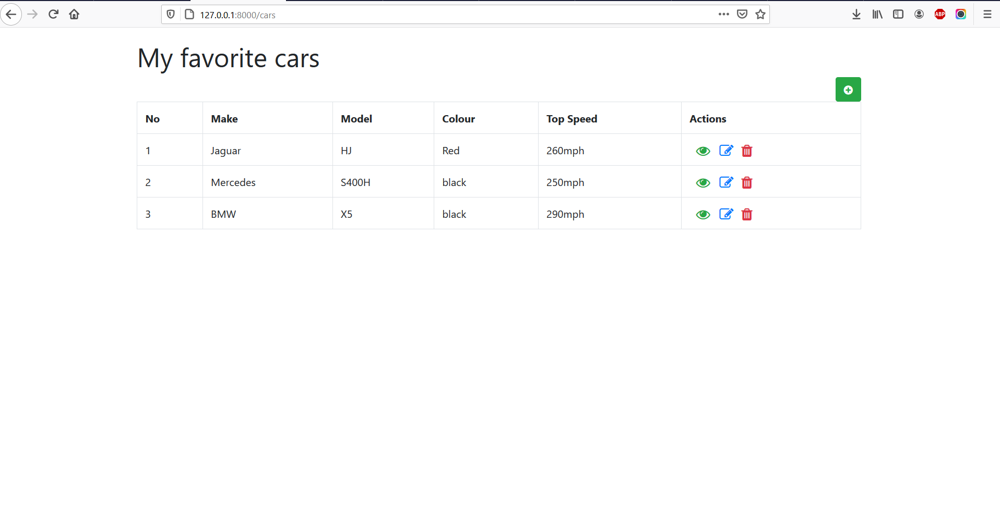

## Table of contents

* [General info](#general-info)
* [Technologies](#technologies)
* [Setup](#setup)

## General info

This project is simple CRUD project using Laravel and SQLite as database.


	
## Technologies

Project is created with:
* Laravel 8
* SQLite
* Composer
* Bootstrap
* Fontawesome
	
## Setup

To run this project, install it locally using the following comands:

```
$ cd ../your-local-destination
$ git init
$ git clone https://github.com/SergiuNuta/laravel-project.git
$ composer install
$ php artisan serve

```