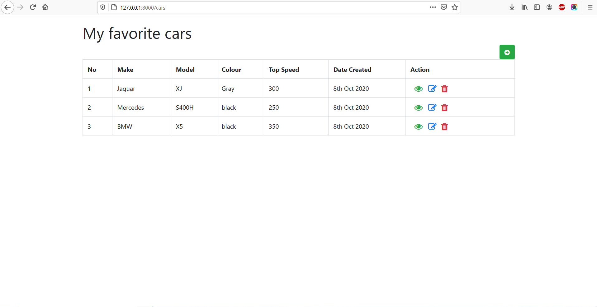

CRUD Laravel project using SQLite as database

## First step

- Clone the project on your machine.

[git init]

[git clone https://github.com/SergiuNuta/laravel-project.git]

## Second step

On your terminal, go to parent location of the project and install composer.

[composer install]

## Third step

Run the server

[php artisan serve]

